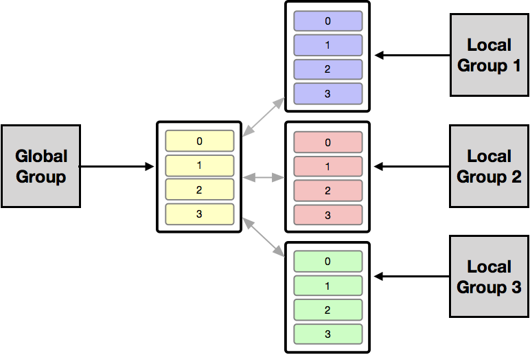

# BFT-SWARM

**BFT-SWARM** is a proof of concept of a partial-genuine byzantine atomic multicast protocol using as base to implementation the library **[BFT-SMART][1]**. The idea behind this project is simple: we use multiple groups of instances of BFT-SMART and the data are partitioned between these groups. Messages that target only to one group are routed locally and messages that are targeted for multiple groups are forwarded to a global group. After the (global) consensus the message is forwarded to the corresponding local(s) group(s).

[1]: https://github.com/bft-smart/library

## Installation

This project requires Java Runtime Environment 1.7 or later to running. For development, tests and deploy is recommend that you have **[Docker][2]** version 17 or later installed.

To develop on a Mac OS environment the following commands must be enough (considering that **[Homebrew][3]** is already installed on the system):
   
    brew install ant
    brew cask install java docker

[2]: https://www.docker.com
[3]: https://brew.sh

## Usage

You should noted that we have a Makefile, so the things here is straight forward. Normally after changing the source code or the configuration files, executing `make build dist up` it's probably what you are looking for.

All configuration files are located in the `/config` folder. To change the topology of the system you must edit `/config/config`. The benchmark settings are located at `/config/configBenchmark`.

For those unfamiliar with docker, here are some tips:
* `docker ps` shows running containers.
* `docker logs -f` gets logs from container.
* `docker inspect` looks at all the info on a container.
* `docker ps -a` shows running and stopped containers.
* `docker stats --all` shows a running list of containers.

We use the docker-compose tool for defining and running our application. Basically all you need to know is located in a YAML file (docker-compose.yml). This file define the configuration of our containers, like the networking information and path variables of each replica.

To start up all replicas, just run `make up` or:

    docker-compose up -d --build --no-deps
    
To start a single container:

    docker-compose -f DOCKER_COMPOSE_FILE up -d --build --no-dep CONTAINER_NAME
    
Launch a console for the specified container (if need, run `docker ps` to get the container name/id):

    docker exec -it CONTAINER_NAME bash

Of course if you prefer you can avoid using Docker. Just remember to manually edit the required files inside the `/config` folder. To run a local replica:

    java -cp '../lib/*:bin/*' ch.usi.dslab.ceolin.bftswarm.Server <node id> <group id> <config path>
    
And for a global replica:

    java -cp '../lib/*:bin/*' ch.usi.dslab.ceolin.bftswarm.ServerGlobal <node id> 0 <global config path> <local config path 1> <local config path 2> <local config path 3> 

To run benchmark (there is a startBenchmark.sh)

    java -cp '../lib/*:bin/*' ch.usi.dslab.ceolin.bftswarm.ClientThroughput <client_id> <local_group_id> <num_of_clients> <num_of_groups> <config-local> <config-global> <debug> <runing_time>
    

### History

This project started as a simple proof of concept that is possible to construct a partial-genuine atomic multicast protocol using the classic approach in broadcast consensus protocols currently available, in this case [BFT-SMART][1] library, a replication library written in Java designed to tolerate Byzantine fault that implements state machine replication.

The basic idea behind this PoC started by deploying 

And this is the second version
 

## Credits

TODO: Write credits.

## Contributing

1. Fork it
2. Create your feature branch: `git checkout -b my-new-feature`
3. Commit your changes: `git commit -am 'Add some feature'`
4. Push to the branch: `git push origin my-new-feature`
5. Submit a pull request

## License

BFT-SWARM - A (hopeful) high-throughput BFT-SMART implementation
Copyright (C) 2017, University of Lugano

This file is part of BFT-SWARM.

BFT-SWARM is free software; you can redistribute it and/or
modify it under the terms of the GNU Lesser General Public
License as published by the Free Software Foundation; either
version 2.1 of the License, or (at your option) any later version.

This library is distributed in the hope that it will be useful,
but WITHOUT ANY WARRANTY; without even the implied warranty of
MERCHANTABILITY or FITNESS FOR A PARTICULAR PURPOSE.  See the GNU
Lesser General Public License for more details.

You should have received a copy of the GNU Lesser General Public
License along with this library; if not, write to the Free Software
Foundation, Inc., 51 Franklin Street, Fifth Floor, Boston, MA  02110-1301  USA